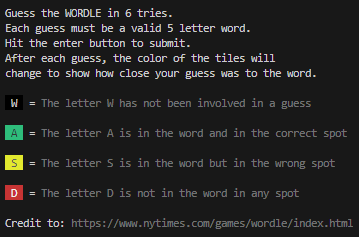
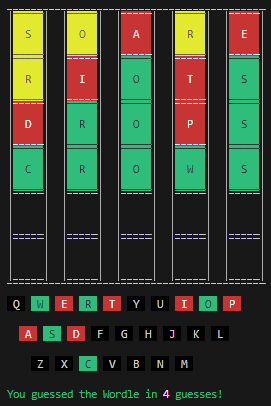
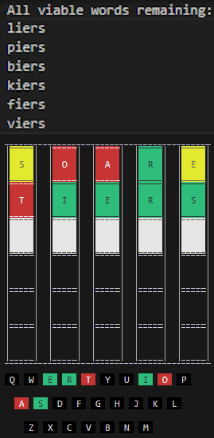

# Wordle
 Wordle via terminal with word assistance using Python

# Dependencies
pip install colorama

# Help
At any time while playing, type "Help" for the instructions of Wordle

# Play
Example of the board on a winning attempt

# Feel like cheating?
Check [src/currentOptions.txt](src/currentOptions.txt) to see the current remaining options, sorted from best to worst using a simple dynamic algorithm

